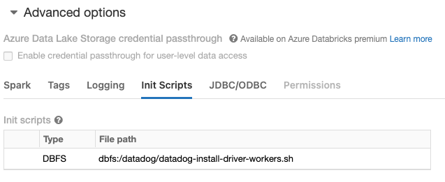
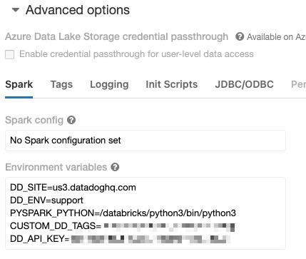

# Datadog & Databricks

This script is a better alternative to the scripts included in the Datadog documentation for
integrating with Databricks. [Follow the steps in the offical documentation](https://docs.datadoghq.com/integrations/databricks),
but use this script instead of the one provided. A detailed blog post for monitoring Databricks with
Datadog is [here](https://www.datadoghq.com/blog/databricks-monitoring-datadog/).

The script is meant to install on all nodes, driver and worker, but if you just want one or the
other, just remove the if/else and the section for the node type that you don't want to instrument
with Datadog.

## Overview

This init script will install a Datadog agent on all nodes, driver and worker, in a Databricks cluster.
It can be also used as a global init script, but requires environment variables to be hard coded as there
is no way to specify global environment variables globally. Variables which need to be uncommendeted and
hard coded for this use case are in the `Customizable Environment Vars` section in the install script.

Driver-node-specific configuration

- Configures a sensible default set of tags: `databricks_cluster_id`, `databricks_cluster_name`, `spark_node`
- Configures the Datadog agent using the cluster environment variables
- Enables [Log Collection](https://docs.datadoghq.com/logs/log_collection) and [Live Processes](https://docs.datadoghq.com/infrastructure/process)
  - Disable Log Collection by setting the `Enable Log Collection` section to `false`
  - Disable Live Processes by setting the `Enable Live Processes` section to `'false'`
- Configures the [Datadog Agent's Spark integration](https://docs.datadoghq.com/integrations/spark) to
  - Collect metrics from the Spark API
  - Collect Spark logs
  - Collect Databricks logs

Worker-node-specific configuration

- Configures a sensible default set of tags: `databricks_cluster_id`, `databricks_cluster_name`, `spark_node`
- Configures the Datadog Agent using the cluster environment variables
- Enables [Live Processes](https://docs.datadoghq.com/infrastructure/process)
  - Disable Live Processes by setting the Enable Log Collection section to `'false'`

### Environment variables

- `DD_SITE` (**required**)
  - Can be one of the following values. Consult the URL you use to access Datadog to choose the appropriate value.
    - `datadoghq.com`
    - `datadoghq.eu`
    - `us3.datadoghq.com`
    - `us5.datadoghq.com`
- `DD_API_KEY` (**required**)
  - Obtain from \_\_\_.datadoghq.\_\_\_/organization-settings/api-keys (replace the domain with the domain you use to access Datadog)
- `DD_ENV` (**required**)
  - This is an important tag that is integral to [Datadog's Unified Service Tagging standard](https://docs.datadoghq.com/getting_started/tagging/unified_service_tagging).
  - Examples: `prod`, `dev`, `qa`, `local`, `test`
- `CUSTOM_DD_TAGS` (_optional_)
  - These can be any tags important to this environment and can represent any concepts that you wish to capture for the Databricks cluster.
  - You must format the values of these tags to [the requirements here](https://docs.datadoghq.com/getting_started/tagging/#defining-tags)
  - The script requires you to format the tags as comma separated `key:value` pairs. The full value must be surrounded in quotes due to bash
    processing syntax
  - Example: `"team:data-science,department:compliance"`

### Notes and considerations

The script requires that your clusters have access to the internet to download `https://s3.amazonaws.com/dd-agent/scripts/install_script.sh`. This `install_script.sh` will install the Datadog Agent using the best method for the target OS. For Debian, this adds Datadog GPG keys, installs the Datadog APT repo, apt installs the dependencies of the Datadog Agent, and installs the Datadog Agent from the Datadog repo.

- In instances of a private cluster, you'll need to host the Datadog Agent package and its dependencies in an internal repo, make the installers
  accessible as deb packages, or provide another way to install these packages without downloading them from the internet. Lines containing the
  `install_script.sh` URL above will need to be replaced with the install method of your choice.
